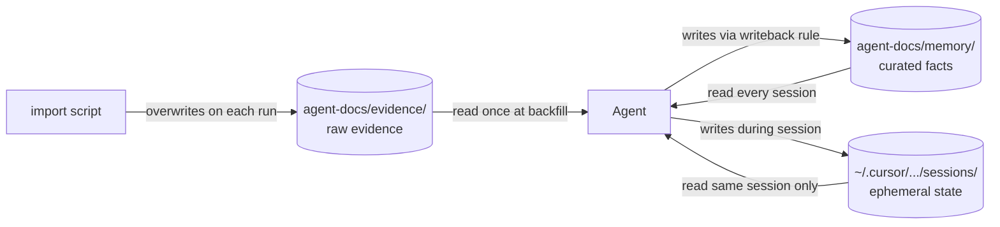
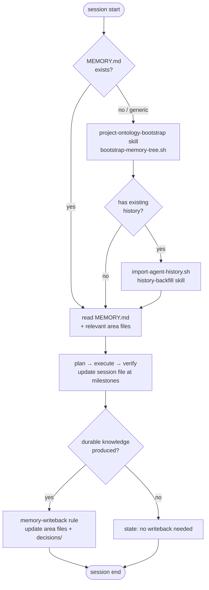
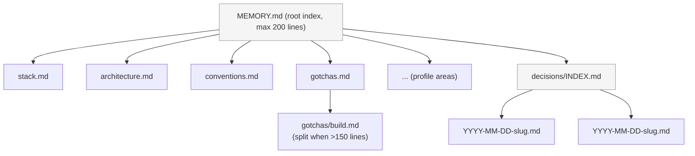
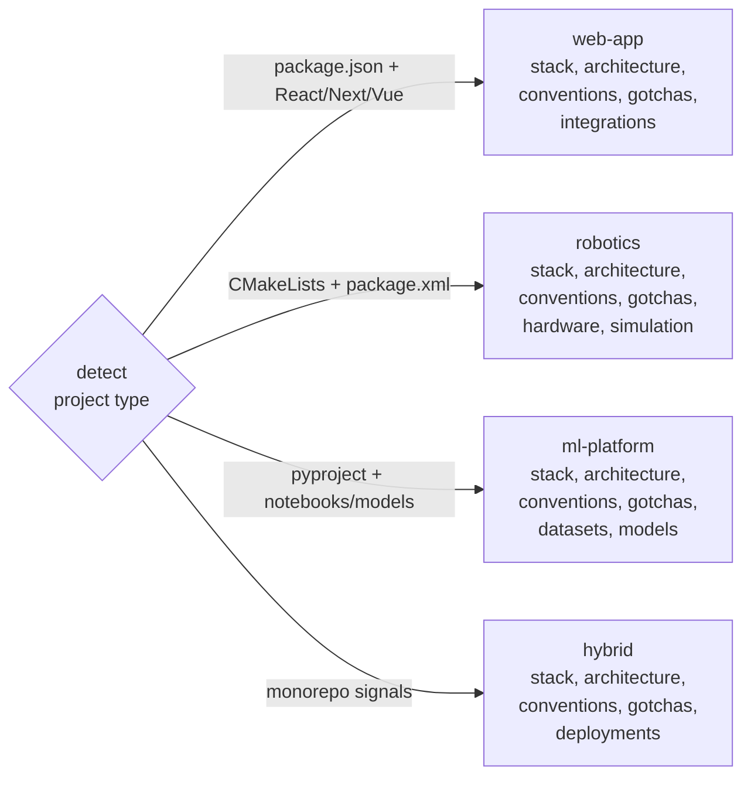
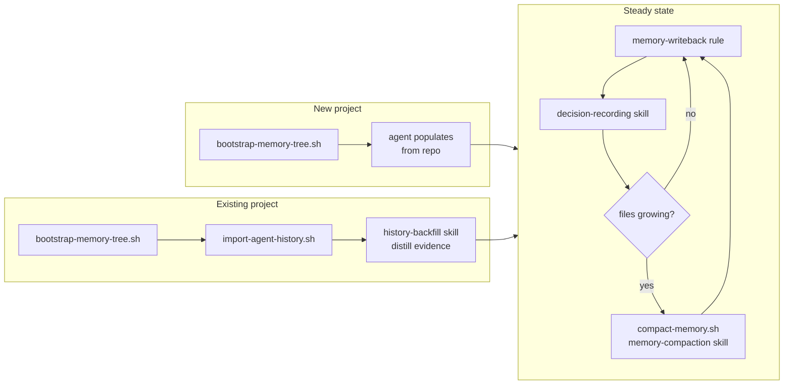

# agents-rules

Personal collection of AI agent rules and skills for Cursor and Claude Code. Install them into any project for consistent, high-quality AI assistance.

## Quick Start

```bash
# Clone
git clone <repo-url> ~/agents-rules

# --- Cursor ---
# Symlink global rules into ~/.cursor/rules/
~/agents-rules/scripts/install-global.sh

# Symlink project rules into a project
~/agents-rules/scripts/install.sh /path/to/project

# --- Claude Code ---
# Install global rules into ~/.claude/CLAUDE.md
~/agents-rules/claude/scripts/install.sh

# Install global rules + scaffold CLAUDE.md in a project
~/agents-rules/claude/scripts/install.sh /path/to/project
```

## Structure

```
agents-rules/
  rules/                    # On-demand Cursor rules (.mdc) — symlinked per project
  rules-global/             # Always-on Cursor rules (.mdc) — symlinked into ~/.cursor/rules/
  skills/                   # Shared skills (memory, sessions, bootstrap, backfill)
  skills-cursor/            # Cursor-specific built-in skills
  templates/memory/         # Memory tree templates and project profiles
  scripts/                  # Install, memory bootstrap, evidence import, compact
  claude/
    global.md               # Source of truth for global Claude Code rules
    project-template.md     # Starter CLAUDE.md for new projects
    scripts/
      install.sh            # Installs global.md into ~/.claude/CLAUDE.md
```

---

## Cursor

### How it works

Rules are **symlinked** into each project's `.cursor/rules/` directory. Edit the source file once — all projects get the update instantly.

### Rules

| File | Always On | Description |
|------|-----------|-------------|
| `rules-global/action-first.mdc` | Yes | Think deeply, act decisively, speak briefly |
| `rules-global/no-icons-emojis.mdc` | Yes | No emojis or icons anywhere |
| `rules-global/no-unsolicited-docs.mdc` | Yes | Never create docs unless asked |
| `rules/workflow-orchestration.mdc` | Yes | Plan-first, subagents, verification, memory flow |
| `rules/memory-writeback.mdc` | Yes | Write durable facts to memory after meaningful changes |
| `rules/memory-bootstrap.mdc` | Yes | Bootstrap memory tree if missing or generic |
| `rules/history-backfill.mdc` | No | Backfill memory from repo evidence when onboarding |
| `rules/generate-architecture-doc.mdc` | No | Generate rich HTML architecture docs |

### Skills

| Directory | Description |
|-----------|-------------|
| `skills/memory-management/` | Memory tree read/write mechanics, sections, bootstrap/compaction triggers |
| `skills/session-management/` | Milestone tracking, writeback gate, session vs memory boundary |
| `skills/project-ontology-bootstrap/` | Detect project type, pick profile, create memory tree |
| `skills/history-backfill/` | Read evidence, distill stable facts into memory areas |
| `skills/memory-compaction/` | Prune, split, and merge memory files when they grow |
| `skills/decision-recording/` | Record architectural decisions as lightweight ADRs |
| `skills-cursor/create-rule/` | Create new Cursor rules |
| `skills-cursor/create-skill/` | Create new skills |
| `skills-cursor/create-subagent/` | Create custom subagents |
| `skills-cursor/migrate-to-skills/` | Migrate rules/commands to skills format |
| `skills-cursor/shell/` | Run shell commands via /shell |
| `skills-cursor/update-cursor-settings/` | Edit Cursor/VSCode settings.json |

### Cursor Scripts

| Script | Usage | Description |
|--------|-------|-------------|
| `scripts/install.sh` | `./install.sh /path/to/project [rule.mdc]` | Symlink rules into a project |
| `scripts/uninstall.sh` | `./uninstall.sh /path/to/project` | Remove symlinked rules |
| `scripts/list.sh` | `./list.sh` | List available rules |
| `scripts/bootstrap-memory-tree.sh` | `./bootstrap-memory-tree.sh [dir] [profile]` | Create memory tree from profile |
| `scripts/import-agent-history.sh` | `./import-agent-history.sh [dir]` | Collect raw evidence into evidence/ |
| `scripts/compact-memory.sh` | `./compact-memory.sh [dir]` | Report memory health and flag large files |

### Adding a Cursor Rule

Create a `.mdc` file in `rules/` or `rules-global/`:

```markdown
---
description: Short description shown in Cursor's rule picker
globs:           # Optional: **/*.ts
alwaysApply: false  # true = always active
---

# Rule Title

Your instructions here...
```

---

## Claude Code

### How it works

Claude Code reads two CLAUDE.md files on every session:

- `~/.claude/CLAUDE.md` — global rules, loaded for all projects
- `<project>/CLAUDE.md` — project-specific rules, loaded for that project only

The install script writes global rules into `~/.claude/CLAUDE.md` inside a managed marker section, so re-running is safe.

### Install global rules

```bash
~/agents-rules/claude/scripts/install.sh
```

### Scaffold a new project

```bash
~/agents-rules/claude/scripts/install.sh /path/to/project
# Creates /path/to/project/CLAUDE.md from project-template.md
# Also installs/updates global rules in ~/.claude/CLAUDE.md
```

Then edit `CLAUDE.md` in the project root with your project-specific stack, conventions, and constraints.

### What global.md contains

- Communication style: action-first, brief, no filler
- Prohibitions: no emojis, no unsolicited docs
- Workflow: plan-first, subagents, verification, elegance, autonomous bug fixing
- Code quality: simplicity, minimal impact, no unnecessary dependencies
- Memory: when and what to save/forget

---

## Shell Aliases (Optional)

```bash
alias ari='~/agents-rules/scripts/install.sh'
alias arl='~/agents-rules/scripts/list.sh'
alias aru='~/agents-rules/scripts/uninstall.sh'
alias arci='~/agents-rules/claude/scripts/install.sh'
alias arbm='~/agents-rules/scripts/bootstrap-memory-tree.sh'
alias arih='~/agents-rules/scripts/import-agent-history.sh'
alias arcm='~/agents-rules/scripts/compact-memory.sh'
```

---

## v2: Adaptive Project Memory

v2 adds a structured memory lifecycle on top of v1's rules and skills.
Memory is adaptive (profile-driven), backfilled (from real history), and enforced (via writeback rule).

### Three-layer separation



### Session lifecycle



### Memory tree structure



### Project profiles



### Area node sections

Every area file (`stack.md`, `gotchas.md`, etc.) has these required sections:

| Section | Content | Updated when |
|---------|---------|--------------|
| **Purpose** | One sentence: what this area covers | At creation |
| **Current State** | Verified facts, true right now | Every writeback |
| **Recent Changes** | Rolling log, pruned after ~4 weeks | After meaningful changes |
| **Decisions** | Links to `decisions/YYYY-MM-DD-slug.md` | When a decision is recorded |
| **Open Questions** | Unresolved items for future sessions | As discovered; removed when resolved |
| **Subtopics** | Links to sub-files if area grows large | When split |

---

### Example A — New project

```bash
cd /path/to/new-project

# Create memory tree (auto-detects project type)
~/agents-rules/scripts/bootstrap-memory-tree.sh .
# Auto-detected profile: web-app
# created: agent-docs/memory/MEMORY.md
# created: agent-docs/memory/stack.md
# created: agent-docs/memory/architecture.md
# created: agent-docs/memory/conventions.md
# created: agent-docs/memory/gotchas.md
# created: agent-docs/memory/integrations.md
# created: agent-docs/memory/decisions/INDEX.md

# Agent reads project-ontology-bootstrap skill, reads the repo,
# fills in Current State in each area file.

# Optional: Cursor symlink
ln -sf "$(pwd)/agent-docs/memory" ~/.cursor/projects/<project-id>/memory
```

### Example B — Existing project backfill

```bash
cd /path/to/existing-project

# 1. Bootstrap structure
~/agents-rules/scripts/bootstrap-memory-tree.sh .

# 2. Collect evidence from git history, docs, manifests, CI
~/agents-rules/scripts/import-agent-history.sh .
# collected: git-log.txt, git-log-detail.txt, manifests.txt,
#            existing-docs.txt, structure.txt, tasks.txt, ci-workflows.txt

# 3. Agent reads history-backfill skill, distills stable facts into area files
```

### Example C — Ongoing writeback

No scripts needed. The `memory-writeback` rule is always active.

After each task the agent evaluates and writes — or explicitly skips:

```
Memory writeback:
- gotchas.md → added: "yarn not in PATH; use node .yarn/releases/yarn-4.x.cjs"
- decisions/ → created 2026-04-06-use-graphql-codegen.md (linked from stack.md)
- architecture.md — no new facts this session.
```

### Example D — Compaction

```bash
~/agents-rules/scripts/compact-memory.sh .
# MEMORY.md: 87 lines  [ok]
# stack.md:  45 lines
# gotchas.md: 163 lines  [WARNING: split candidate]
# architecture.md: 12 lines
#
# Action needed: ask the agent to read the memory-compaction skill and compact.
```

### Memory lifecycle


